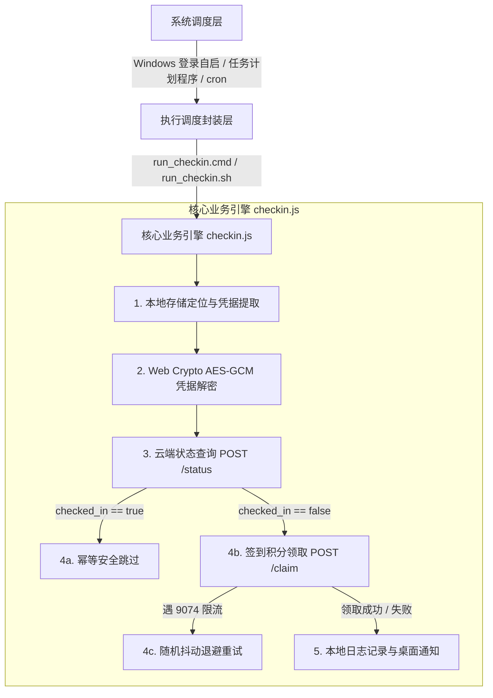
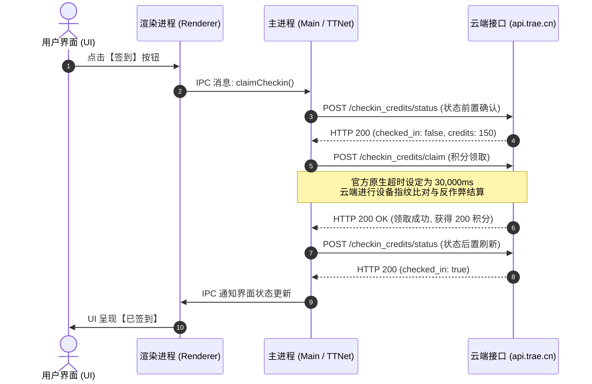

# TraeWork 每日自动签到技术分析与实现文档

---

## 一、 项目背景与架构总览

### 1.1 业务背景
[Trae](https://www.trae.cn/)（字节跳动推出的 AI 原生集成开发环境）在国内推出了每日签到领积分活动（基础 150 积分 + 额外 50 积分，单日共计 200 积分）。为免除每日人工打开客户端、查找入口并点击签到的繁琐流程，本项目实现了一套**完全静默、跨平台、自适应多版本客户端**的每日自动签到方案。

### 1.2 整体架构设计
项目由三大核心层级构建：



---

## 二、 核心逆向与客户端行为分析

在对客户端真实点击行为进行监听与捕获的过程中，我们深入挖掘了 TraeWork 内部的通信链路与底层网络体系。

### 2.1 客户端技术栈与进程模型
TraeWork 采用了标准的 **Electron + VS Code 分布式多进程架构**：
* **渲染进程（Renderer Process）**：负责前端 UI 绘制与交互展示（Webkit/Chromium 内核）；
* **主进程（Main Process）**：以 Node.js 和 C++ 原生扩展运行的宿主环境，控制窗口生命周期、底层系统调用及网络传输。

### 2.2 为什么前端 DevTools（F12 / Ctrl+Shift+I）中搜不到签到请求？
在用户交互过程中，用户在界面点击【签到】按钮后，若直接在前端 Network 面板过滤 `claim` 或 `checkin`，结果为空。其底层技术原因在于：
1. **IPC 进程解耦**：前端 UI 点击事件触发后，仅通过进程间通信（IPC Channel）向主进程发送指令；
2. **字节自研 TTNet 底座**：主进程底层并没有使用 Chromium 的通用网络栈，而是通过字节跳动自研的 **TTNet（AlaudaNet）** 库直接向云端发起安全连接。因此，网络流量只存在于操作系统主进程中，不会流经渲染进程的 WebKit Network 监听面板。

### 2.3 客户端底层时序证据（摘自 `main.log`）
通过检索客户端生成的实时系统主进程日志（`TRAE SOLO CN\logs\20260909T160010\main.log`），完整还原了用户点击签到时的交互流水：

```log
[16:01:19.420] [info] ttnet fetch request https://api.trae.cn/trae/api/v2/ug/checkin_credits/status
[16:01:21.334] [info] ttnet fetch request https://api.trae.cn/trae/api/v2/ug/checkin_credits/claim
...
[16:01:56.257] [info] ttnet fetch request https://api.trae.cn/trae/api/v2/ug/checkin_credits/claim
[16:02:09.589] [info] ttnet fetch response https://api.trae.cn/trae/api/v2/ug/checkin_credits/claim 200 OK
[16:02:09.608] [info] ttnet fetch request https://api.trae.cn/trae/api/v2/ug/checkin_credits/status
[16:02:09.812] [info] ttnet fetch response https://api.trae.cn/trae/api/v2/ug/checkin_credits/status 200 OK
```

完整的请求交互时序图如下：



---

## 三、 本地凭据发现与解密机制

自动化程序无需用户手动抓包输入 Token，而是直接读取本地客户端的持久化登录会话。

### 3.1 跨版本与多路径自适应发现
用户计算机上可能存在不同历史版本或衍生版本的客户端（如 `Trae CN`、`TRAE SOLO CN`、`Trae` 等）。程序在 `findStorageFile()` 中实现了动态扫描机制：
1. 扫描 `%APPDATA%` 下所有包含 `trae` 的文件夹；
2. 检验是否存在 `User/globalStorage/storage.json` 并包含 `iCubeAuthInfo://icube.cloudide` 字段；
3. **按文件最后修改时间倒序排列（`mtime`）**，确保当用户切换或登录新的 Trae 客户端时，程序始终自动读取最新活跃的登录态。

### 3.2 Web Crypto AES-GCM-256 解密算法
Trae 本地将用户登录凭据（含 JWT Token、用户 ID、过期时间、区域信息）以加密字符串形式存储。解密流程如下：

| 数据段 | 长度 / 结构 | 作用 |
| :--- | :--- | :--- |
| 密文结构 | `HEX 字符串` | Base64 或 Hex 编码的加密载体 |
| 盐值 (Salt) | 预置工程常量 | 用于密钥派生 |
| 密钥派生算法 | `PBKDF2 (SHA-256, 10000 轮)` | 生成 AES-256 密钥 |
| 初始向量 (IV) | 前 12 字节 | AES-GCM 标准初始化向量 |
| 认证标签 (AuthTag) | 尾 16 字节 | GCM 完整性校验标签 |

解密成功后即可获取明文 JSON：
```json
{
  "token": "eyJhbGciOi...",
  "userId": 159914000000,
  "expiredAt": 1788940800,
  "userRegion": {
    "region": "CN"
  }
}
```

---

## 四、 核心挑战与攻防对齐策略

### 4.1 超时机制对齐（30 秒窗口）
* **问题发现**：早期独立脚本默认设置了 15 秒的请求超时保护，但在高并发或服务器限流处理时，请求常在第 15 秒被脚本主动掐断并报错 `fetch failed`。从 `main.log` 可以看到，官方客户端原生设置的请求超时时间为 **30,000ms（30 秒）**。
* **解决方案**：在 [`checkin.js`](file:///E:/AutoCheckin/checkin.js#L148-L155) 中将超时时间全面对齐为 30 秒（`AbortSignal.timeout(30000)`），配合网络抖动自动指数退避重试，保证请求平稳送达。

### 4.2 错误码 9074（当前参与用户太多，请稍后再试）防御
* **问题剖析**：`9074` 是字节跳动后端（火山引擎）在每天特定高峰期对并发签到请求实施的限流防护。当返回 `9074` 时，说明凭证、Header、设备指纹均 100% 正确，但请求暂时被限流拦截。
* **抖动退避重试算法**：
  为避免死板的固定周期重试再次撞上限流桶，程序设计了随机抖动退避算法：
  ```javascript
  const delaySec = Math.floor(Math.random() * 15) + 12; // 12~26 秒随机浮动
  ```
  在领取积分阶段赋予最高 8 轮的自动重试能力，有效穿透服务器拥塞窗口。若多轮后仍处于拥堵极值，输出友好提示并等待下一次自动调度，杜绝频繁请求被风控标记。

### 4.3 终端乱码与平台兼容性（CP936 vs UTF-8）
* **问题**：Windows 控制台默认使用代码页 936 (GBK)，而 Node.js 默认以 UTF-8 输出中文日志，导致控制台输出形如 `TraeWork 姣忔棩鑷姩...` 的乱码。
* **解决**：在 [`run_checkin.cmd`](file:///E:/AutoCheckin/run_checkin.cmd#L1-L3) 开头注入 `@chcp 65001 >nul`，强制将 CMD 代码页无感重定向至 UTF-8，确保全终端中文显示清晰。

---

## 五、 自动化调度与全流程闭环

### 5.1 幂等性保障（防重复签到）
1. 每次程序执行，必须首先调用 `/checkin_credits/status` 获取当日真实状态；
2. **已签到场景**：若 `status.checked_in === true`，程序直接输出 `[已签到] 检测到今日已完成签到，自动跳过！累计积分: 200`，立即安全退出（耗时 < 2 秒），零重复网络开销；
3. **未签到场景**：调用 `/checkin_credits/claim`，完成签到后通过 Windows Runtime API 弹出原生桌面 Toast 通知。

### 5.2 开机自启管理体系
项目提供了纯中文交互界面的管理脚本 [`manage_autostart.cmd`](file:///E:/AutoCheckin/manage_autostart.cmd)，底层由 PowerShell 驱动：
* 支持键盘 `↑` / `↓` 方向键与数字键交互切换；
* 一键注册 Windows 启动目录快捷方式，参数附带 `--silent` 静默运行模式；
* 支持一键彻底卸载与单次手动测试。

---

## 六、 维护与排查参考字典

| 状态码 / 异常信息 | 诱发原因 | 处理对策与系统行为 |
| :--- | :--- | :--- |
| `checked_in: true` | 当日已经完成签到 | **正常逻辑**：秒级退出，记录日志并跳过 |
| `Code: 0` | 签到成功 | **正常逻辑**：领取积分，写入日志并弹出桌面通知 |
| `Code: 9074` | 官方服务器高峰并发限流 | **自动处理**：自动进行 12~26 秒抖动退避重试（最高 8 轮） |
| `Code: 9004` | 请求缺少设备标识头参数 | **已被系统杜绝**：自动注入 `X-Machine-Id`, `X-Device-Id`, `X-User-Region` |
| `Token Expired` | 超过 30 天未打开过 Trae | 启动一次 Trae 客户端刷新即可自动恢复 |
